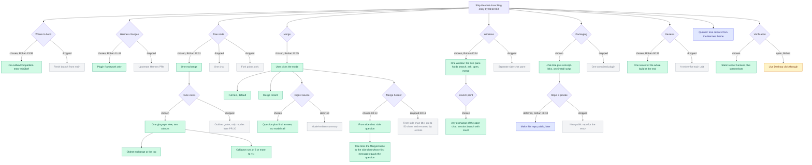

# Decision tree: the competition build

Updated: 2026-11-12 00:30 IST. Green is chosen. Grey is dropped. Yellow is open.

```mermaid
flowchart TD
  G[Ship the chat-branching entry by 03:30 IST]

  G --> B{Where to build}
  B -->|chosen, Rohan 23:55| B1[On outbox/competition-entry 46a3bef]
  B -->|dropped| B2[Fresh branch from main]

  G --> H{Hermes changes}
  H -->|chosen, Rohan 11-11| H1[Plugin framework only]
  H -->|dropped| H2[Upstream Hermes PRs]

  G --> T{Tree node}
  T -->|chosen, Rohan 22:31| T1[One exchange]
  T -->|dropped| T2[One chat]
  T -->|dropped| T3[Fork points only]

  T1 --> V{Pane views}
  V -->|chosen| V1[One git-graph view, two colours]
  V -->|dropped| V2[Outline, gutter, strip modes from PR 20]
  V1 --> O[Oldest exchange at the top]
  V1 --> C[Collapse runs of 3 or more to +N]

  G --> M{Merge}
  M -->|chosen, Rohan 22:35| M1[User picks the mode]
  M1 --> M2[Full text, default]
  M1 --> M3[Merge record]
  M1 --> M4{Digest source}
  M4 -->|chosen| M5[Question plus final answer, no model call]
  M4 -->|deferred| M6[Model-written summary]
  M1 --> M7{Merge header}
  M7 -->|chosen 00:13| M9[From side chat: side question]
  M7 -->|dropped 00:13| M10[From side chat: title, cut to 50 chars and renamed by Hermes]
  M9 --> M8[Tree links the Merged node to the side chat whose first message equals the question]

  G --> W{Windows}
  W -->|chosen, Rohan 00:24| W1[One window: the tree pane holds branch, ask, open, merge]
  W -->|dropped| W2[Separate side-chat pane]
  G --> P{Packaging}
  P -->|chosen| P1[chat-tree plus concept-links, one install script]
  P -->|dropped| P2[One combined plugin]
  G --> RV{Reviews}
  RV -->|chosen, Rohan 00:22| RV1[One review of the whole build at the end]
  RV -->|dropped| RV2[A review for each unit]
  G --> TC[Queued: tree colours from the Hermes theme]
  P1 --> R{Repo is private}
  R -->|deferred, Rohan 00:10| R1[Make this repo public, later]
  R -->|dropped| R2[New public repo for the entry]

  G --> Q{Verification}
  Q -->|chosen| Q1[Static render harness plus screenshots]
  Q -->|open, Rohan| Q2[Live Desktop click-through]

  W1 --> F{Branch point}
  F -->|chosen| F2[Any exchange of the open chat: session.branch with count]

  classDef chosen fill:#d1fae5,stroke:#059669,color:#064e3b
  classDef dropped fill:#f3f4f6,stroke:#9ca3af,color:#6b7280
  classDef open fill:#fef3c7,stroke:#d97706,color:#78350f
  class B1,H1,T1,V1,O,C,M1,M2,M3,M5,M9,M8,P1,Q1,W1,RV1,F2 chosen
  class B2,H2,T2,T3,V2,M6,M10,P2,R2,W2,RV2 dropped
  class Q2 open
  classDef deferred fill:#e0e7ff,stroke:#6366f1,color:#312e81
  class R1,TC deferred
```
