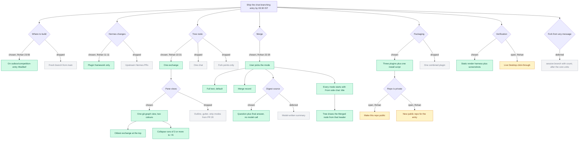

# Decision tree: the competition build

Updated: 2026-11-12 00:05 IST. Green is chosen. Grey is dropped. Yellow is open.

```mermaid
flowchart TD
  G[Ship the chat-branching entry by 03:30 IST]

  G --> B{Where to build}
  B -->|chosen, Rohan 23:55| B1[On outbox/competition-entry 46a3bef]
  B -->|dropped| B2[Fresh branch from main]

  G --> H{Hermes changes}
  H -->|chosen, Rohan 11-11| H1[Plugin framework only]
  H -->|dropped| H2[Upstream Hermes PRs]

  G --> T{Tree node}
  T -->|chosen, Rohan 22:31| T1[One exchange]
  T -->|dropped| T2[One chat]
  T -->|dropped| T3[Fork points only]

  T1 --> V{Pane views}
  V -->|chosen| V1[One git-graph view, two colours]
  V -->|dropped| V2[Outline, gutter, strip modes from PR 20]
  V1 --> O[Oldest exchange at the top]
  V1 --> C[Collapse runs of 3 or more to +N]

  G --> M{Merge}
  M -->|chosen, Rohan 22:35| M1[User picks the mode]
  M1 --> M2[Full text, default]
  M1 --> M3[Merge record]
  M1 --> M4{Digest source}
  M4 -->|chosen| M5[Question plus final answer, no model call]
  M4 -->|deferred| M6[Model-written summary]
  M1 --> M7[Every mode starts with From side chat: title]
  M7 --> M8[Tree draws the Merged node from that header]

  G --> P{Packaging}
  P -->|chosen| P1[Three plugins plus one install script]
  P -->|dropped| P2[One combined plugin]
  P1 --> R{Repo is private}
  R -->|open, Rohan| R1[Make this repo public]
  R -->|open, Rohan| R2[New public repo for the entry]

  G --> Q{Verification}
  Q -->|chosen| Q1[Static render harness plus screenshots]
  Q -->|open, Rohan| Q2[Live Desktop click-through]

  G --> F{Fork from any message}
  F -->|deferred| F1[session.branch with count, after the core units]

  classDef chosen fill:#d1fae5,stroke:#059669,color:#064e3b
  classDef dropped fill:#f3f4f6,stroke:#9ca3af,color:#6b7280
  classDef open fill:#fef3c7,stroke:#d97706,color:#78350f
  class B1,H1,T1,V1,O,C,M1,M2,M3,M5,M7,M8,P1,Q1 chosen
  class B2,H2,T2,T3,V2,M6,P2,F1 dropped
  class R1,R2,Q2 open
```
